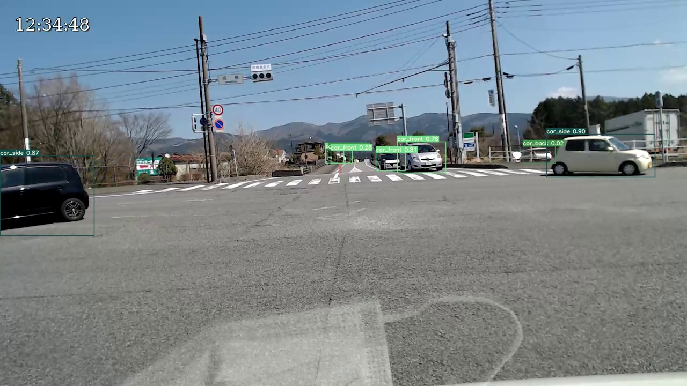
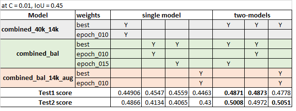

# IEEE2022-VOD-Submission
The repository contains the source code and trained models for [Vehicle class and Orientation Detection Challenge 2022](https://vod2022.sekilab.global/overview/) that was held as part of IEEE Big Data Cup 2022.

Maximum score of 0.4873 on test-1 and 0.5051 on test-2 were achieved.

<p align="center"></p>

# Table of contents

- [IEEE2022-VOD-Submission](#ieee2022-vod-submission)
- [Table of contents](#table-of-contents)
- [Steps](#steps)
  - [Download this repo](#download-this-repo)
  - [Copying the data](#copying-the-data)
    - [Training data](#training-data)
    - [Validation data](#validation-data)
    - [Test data](#test-data)
  - [Training the model & Inference](#training-the-model--inference)
    - [Creating and running Docker Image](#creating-and-running-docker-image)
    - [Running the model for training and inference](#running-the-model-for-training-and-inference)
  - [Performance on test datasets](#performance-on-test-datasets)
- [References](#references)

# Steps
## Download this repo
Download this repository either using `git clone` or downloading the source code as zip.
After cloning, enter the directory using `cd IEEE2022-VOD-Submission`.

## Copying the data
### Training data
Copy training images (both train-1 and train-2 data) and their yolo labels to `main_train/images` and `main_train/labels` respectively.

### Validation data
- [Vehicle Orientation Dataset](https://github.com/sekilab/VehicleOrientationDataset) has been used for validation.
- Modify the labels of this dataset to suit as per Synthetic orientation dataset. You may use [validation_annotation.py](https://github.com/POONAM2015/IEEE2022-VOD-Submission/blob/main/main_test/validation_annoation.py)
- Copy validation images and their yolo labels to `main_test/images` and `main_test/labels` respectively.

### Test data
Copy images of test-1 and test-2 (provided by Challenge) to `test_1/images` and `test_2/images` respectively.


## Training the model & Inference

### Creating and running Docker Image
Make a docker image containing [YOLOv7 source code](https://github.com/WongKinYiu/yolov7) using the command
```bash
docker build -t yolov7:pytorch21.08-py3 .
```
Start the docker container using
```bash
nvidia-docker run --rm --name yolov7_vehicle_docker -p 6006:6006 --ipc=host -it -v "`pwd`":/usr/src/mydataset -v "`pwd`/yolov7_vehicle/runs":/usr/src/app/yolov7/runs --shm-size=8g yolov7:pytorch21.08-py3
```

### Running the model for training and inference
Run [yolov7_vehicle/runs/work.ipynb](yolov7_vehicle/runs/work.ipynb)

## Performance on test datasets



# References
1. https://github.com/WongKinYiu/yolov7
2. https://github.com/sekilab/VehicleOrientationDataset
